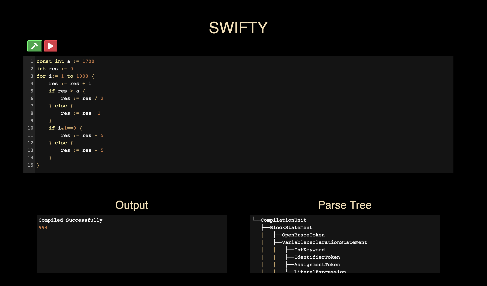

# SWIFTY
[](https://dev.azure.com/shubhamchess/Swifty/_build/latest?definitionId=1&branchName=master)
[](https://lgtm.com/projects/g/neverwannafly/Swifty/alerts/)
[](https://lgtm.com/projects/g/neverwannafly/Swifty/context:javascript)
[](https://lgtm.com/projects/g/neverwannafly/Swifty/context:csharp)

## CodeEditor Preview
<p align="center"></p>

## Syntax (Currently Supported)
```
# Variable declarations #
int a := 10
bool b := True
char c := '$' 
const int a := -8
const bool b := False
const char c := '9'

# operators #
# 1) Unary Operators
- + ! ~
# 2) Binary Operators
- + * / := & | ^ && || == { } ( ) > < >= <=
# 3) Typecast Operator
(expression)=>(datatype) :  typecast operator (usage: 10 => bool, True => int)
                            returns -1 on failure

# control flows and loops #
if i > 10 {} else {}       # if else construct
for int i := 1 to 10 {}    # for loop construct
while i < 10 {}            # while loop construct
```

## Getting everything ready!
### Producing C# executable (backend)
* If you're running osx-64 bits, run `chmod +x app.sh && ./app.sh publish`. This will create a self contained c# executable and it's path is already set in config.js
* For other platforms, you can run `dotnet publish -r <architecture> -c Release /p:PublishSingleFile=true` or amment the 
desired architecture in app.sh and then run `chmod +x app.sh && ./app.sh publish`
* <b>NOTE</b> You must have dotnet 3.1.x installed
##### Now you'll end up with a self contained C# executable

### Linking FrontEnd to BackEnd
* If you did step 2 of producing a c# executable, you must update the path of executable in config.js to the appropriate path to the executable
##### You've now successfully linked the front end to the backend

### Running CodeEditor
* First install all the dependencies by running `npm install`
* Then run the server by `nodemon server.js` or `node server.js` and going to http://localhost:3000
##### CodeEditor is now live! You can write swifty code and get feedback in your browser window

#### ~@Neverwannafly
